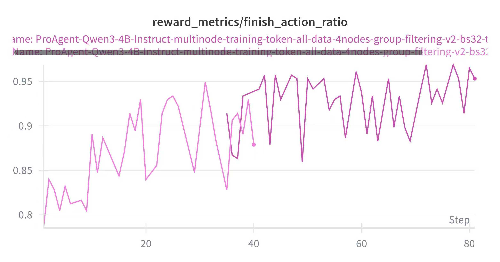
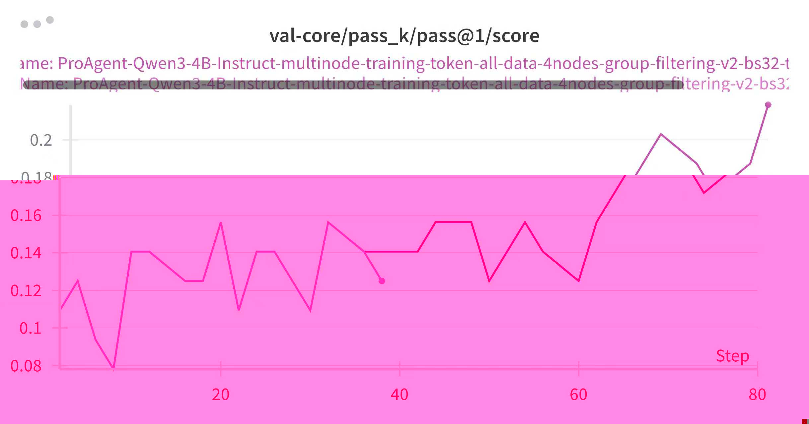
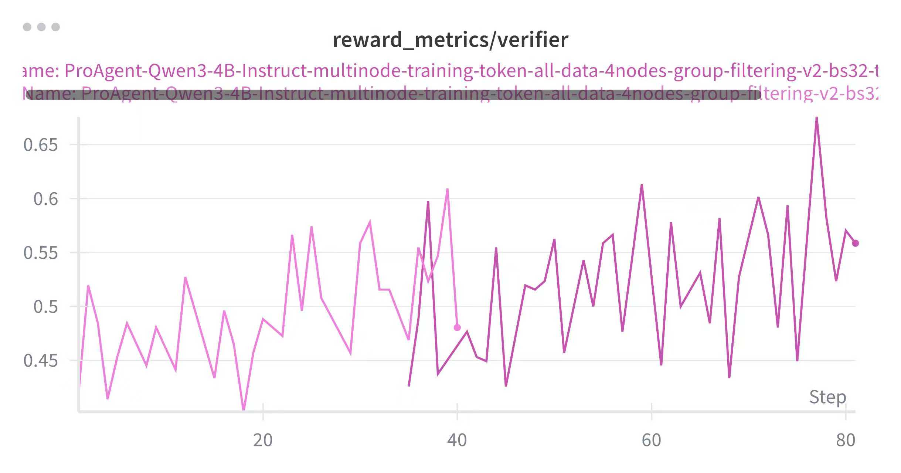

<div align="center">

# ProRLAgent Server: A Scalable Multi-turn Rollout Infrastructure for RL Agents Training

</div>

<div align="center">

[](https://codecov.io/gh/NVIDIA-NeMo/ProRL-Agent-Server)
[](https://github.com/NVIDIA-NeMo/ProRL-Agent-Server/actions/workflows/cicd-main.yml)
[](https://www.python.org/downloads/release/python-3100/)
[](https://github.com/NVIDIA-NeMo/ProRL-Agent-Server/stargazers/)

</div>

## ☁️ Introduction

ProRLAgent Server is a scalable multi-turn rollout system for training and evaluating RL agents. Built on top of OpenHands, it offers high concurrency and a pluggable handler interface to support diverse agent tasks.

- **Decoupled RL Training & Rollouts:** rollouts run as a service; any RL trainer can consume the outputs.
- **High concurrency:**  execute large-scale jobs with LLM load balancing.
- **Pluggable AgentHandler:**  customize for different tasks and agents.
- **Lifecycle management:**  built-in support for status tracking, queuing, timeouts, and cleanup.
- **Token-in / Token-out:** communicate in tokens to maintain turn alignment and ensure stable training.

## 💻 Quick Start

1) Install dependencies

```bash
poetry install --with dev,test,runtime,evaluation
INSTALL_DOCKER=0 make -f Makefile.singularity build
```

2) Start the VLLM server with your desired Hugging Face model:

```bash
vllm serve path_to_hf_model
```

Replace `path_to_hf_model` with the actual path to your Hugging Face model.

Example:
```bash
vllm serve /path/Qwen3-8B --enable-auto-tool-choice --tool-call-parser hermes --reasoning-parser deepseek_r1 --host 127.0.0.1 --port 8000
```

3) Pull singularity sandboxs for SWE tasks

```bash
python scripts/pull_swe_images.py --parquet-file /path/to/train.parquet --dest-dir /some/dir
export OH_RUNTIME_SINGULARITY_IMAGE_REPO=/path/to/singularity_images
```

4) Start the async evaluation server (FastAPI)

This command starts the FastAPI-based async evaluation server and listens on the given host/port.
It exposes /start, /process, and /status endpoints, and uses --max-init-workers/--max-run-workers and --timeout to control concurrency and time limits.

```bash
python scripts/start_server.py --host 0.0.0.0 --port 8006 --max-init-workers 64 --max-run-workers 64 --timeout 300
```

5) Test the server (HTTP I/O)

Quick try: send a task to `/process` and read the JSON result.

Input (request body):
- `instance`: the task info (must include `data_source` and any fields your handler needs)
- `sampling_params`: optional LLM/agent settings (e.g., `temperature`, `top_p`, `max_tokens`)
- `job_id` (optional): your own identifier

Example:

```bash
curl -s -X POST http://localhost:8006/process \
  -H 'Content-Type: application/json' \
  -d '{
    "instance": {
      "data_source": "swebench",
      "instance_id": "repo__issue__hash",
      "trajectory_id": "t0",
      "patch": "",
      "metadata": {}
    },
    "sampling_params": {"temperature": 0.3, "top_p": 0.95}
  }'
```

Output (response body):

```json
{
  "resolved": true,
  "report": {"pass@1": 0.0, "details": {"...": "..."}},
  "timing": {"init": 2.1, "run": 41.3, "eval": 5.2, "others": 1.4, "timeout": 300.0}
}
```

## 💻 Add a New Task/Handler

To add a new task:

- Implement an `AgentHandler` with `name`, `init(job_details, ...)`, `run(job_details, ...)`, and `eval(job_details, ...)`.
- Register it in the registry so that `instance["data_source"] == name` routes requests to your handler.
- Provide a `final_result(job_details)` function for result shaping.
- Ensure your handler returns a consistent result schema and handles timeouts/errors.

Minimal sketch:

```python
from openhands.nvidia.registry import AgentHandler, register_agent_handler

class MyTaskHandler(AgentHandler):
    @property
    def name(self) -> str: return "my_task"
    async def init(self, job_details, sid=None, **kwargs):
        return runtime, metadata, config
    async def run(self, job_details, sid=None, **kwargs):
        return {"git_patch": "...", "messages": []}
    async def eval(self, job_details, sid=None, allow_skip=True, reward=None):
        return {"report": {"resolved": True}}

register_agent_handler(MyTaskHandler())
```

Then submit requests with `{"data_source": "my_task", ...}` in the `instance`.

## 💻 Run unit tests
Example:
```bash
TEST_RUNTIME=singularity RUN_AS_OPENHANDS=False PYTHONPATH='.' pytest tests/runtime/test_browsing.py -v -s
```

### Important Environment Variables

#### Image Storage Location
**`OH_RUNTIME_SINGULARITY_IMAGE_REPO`** - Specifies the directory where Singularity runtime images will be stored.
```bash
OH_RUNTIME_SINGULARITY_IMAGE_REPO=/path/to/singularity_images
```

#### Network Isolation
**`SANDBOX_ISOLATE_NETWORK`** - Controls whether to run the container in an isolated network environment for enhanced security.
```bash
SANDBOX_ISOLATE_NETWORK=true
```

#### Fakeroot Execution
**`SANDBOX_RUN_AS_FAKEROOT`** - Enables running the container with fakeroot privileges, allowing processes to appear as root without requiring actual root access on the host system. Note: This is typically not needed when running on SLURM clusters.
```bash
SANDBOX_RUN_AS_FAKEROOT=true
```

## 📄 Documentation

More module READMEs (click to open):

- [`openhands/README.md`](openhands/README.md)
- [`openhands/nvidia/README.md`](openhands/nvidia/README.md)
- [`openhands/llm/nvidia/README.md`](openhands/llm/nvidia/README.md)
- [`scripts/README.md`](scripts/README.md)
- [`tests/nvidia/README.md`](tests/nvidia/README.md)

## 💡 Current Results

<p align="center">
  
  
  
</p>

To validate the functionality of the ProRLAgent servers, we conducted proof-of-concept experiments on software engineering (SWE) tasks by integrating the server with the Verl reinforcement learning (RL) framework. Specifically, we used swe-gym along with a subset of the R2E-gym dataset, comprising a total of 800 training instances, to perform GRPO training. Our experiments were carried out on the Qwen3-4B-Instruct model and evaluated on the SWE-Bench-Verified benchmark. The results demonstrate a performance improvement, with accuracy increasing from **15.0%** to **20.4%**.

